# Results

## Diversity statistics

We computed the diversity statistics for various different cohorts in order to observe how they change between locations, time points and taxa. 
All _An. coluzzii_ aerial samples were grouped together. 
We observe no statistically significant difference in term of diversity statistics within a taxa through time or geography despite the great distance and number of generations separating the various cohorts. 
It might be worth observing that two populations in Mali (_An. coluzzii_ from Dallowere collected in May and June 2014) look a little different.  
The diversity statistics for the aerial samples look higher from the ones for other _An. coluzzii_ cohorts. 

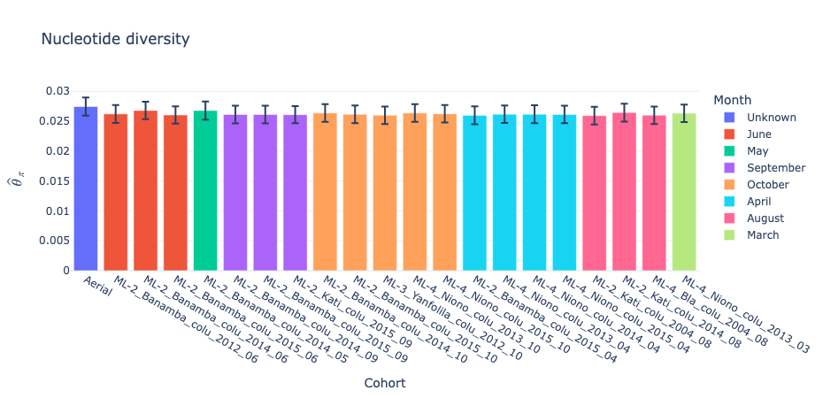
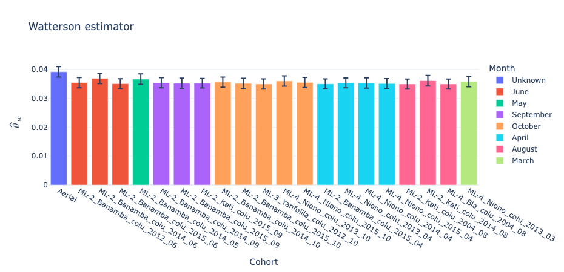
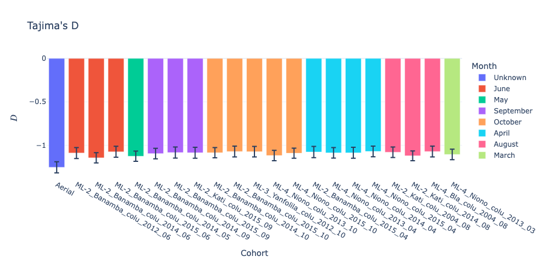
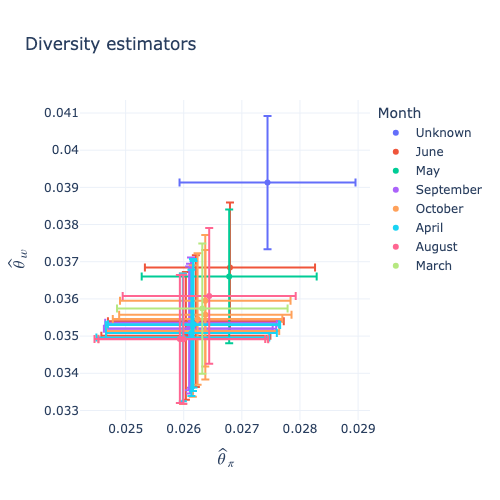

When comparing the diversity statistic with surrounding countries we observe very similar results from Burkina Faso and the two northern locations in Côte d'Ivoire and Ghana. 
Diversity statistics are slightly different in southern, or costal, regions of Côte d'Ivoire, Ghana and Benin. 
The diversity statistics are even more different for the Guinean samples.
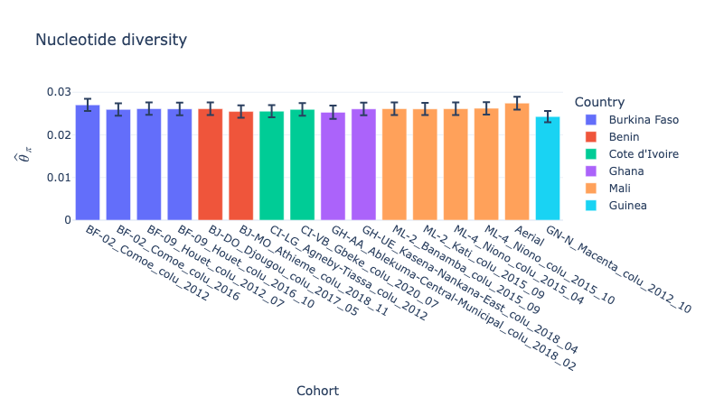
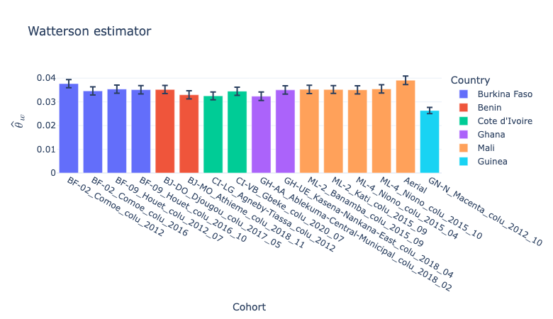
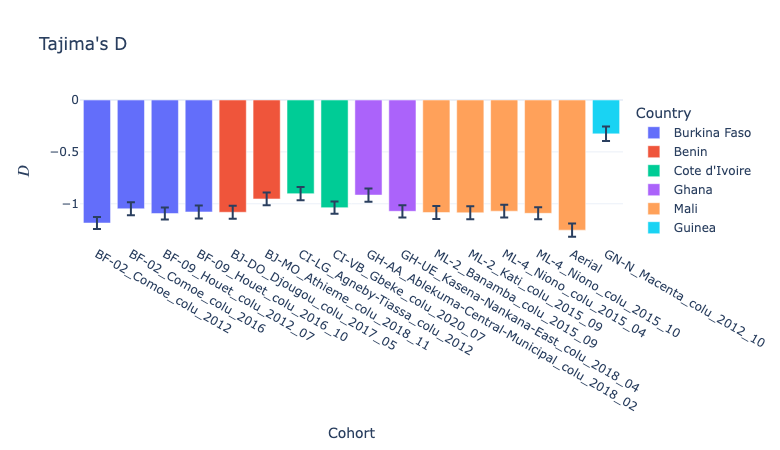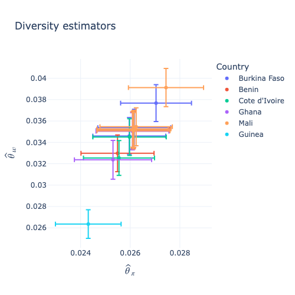
Looking at the diversity statistics for _An. gambiae_, we observe something similar to what was observed for _An. coluzzii_. 
All cohorts, except for the ones from Kangaba which are much older, yield very close results. 
Because there is only one aerial _An. gambiae_ sample, it could not be compared to other cohorts. 

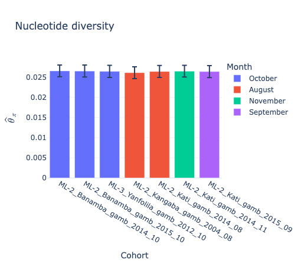
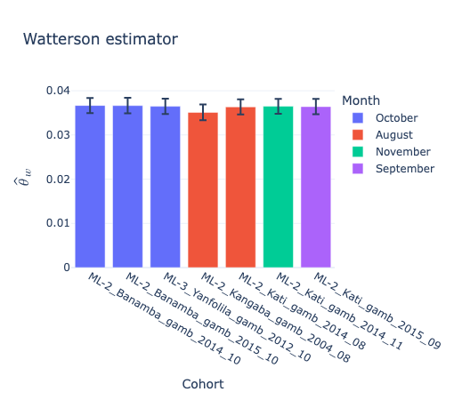
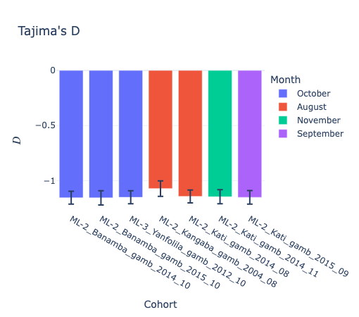
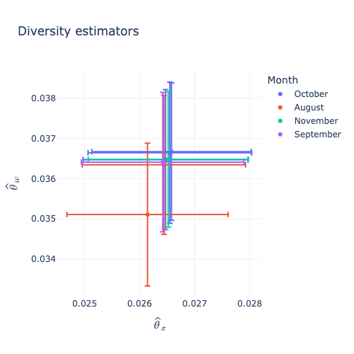

When comparing with cohorts from other countries, we get very similar results. 
We extended the geographic and temporal range of cohorts as far as the Central African Republic in 1994. 
Some cohorts, in southern Ghana and Togo yield, maybe significantly, lower values while one cohort in Burkina Faso from Haut-Bassins seems to yield higher, though not significantly so, values.

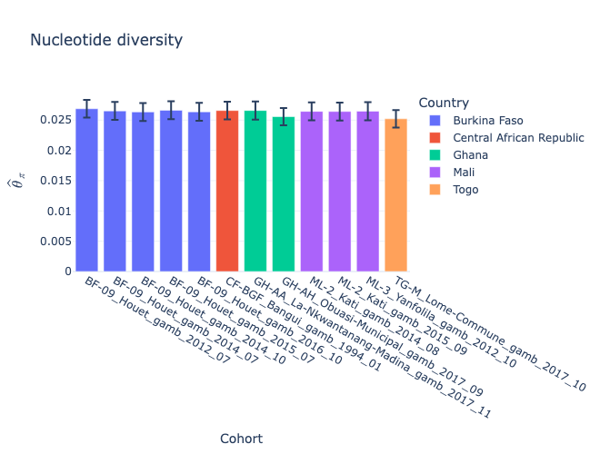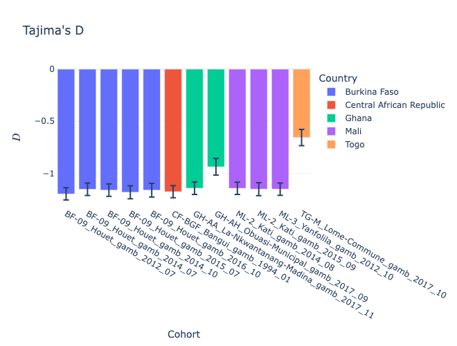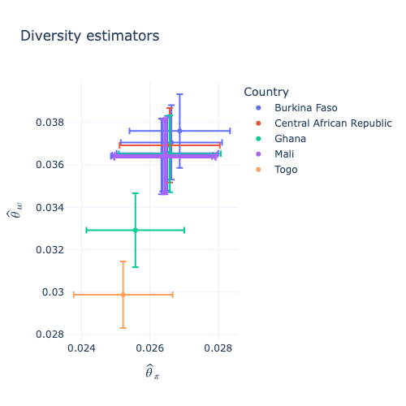

In Mali, diversity statistics also look very similar between _An. gambiae_ and _An. coluzzii_ but diversity statistics look different for the only _An. arabiensis_ cohorts. 
If we extend this analysis to other samples from West Africa, we observe that this trend continues but the _An. arabiensis_ from the Gambia and Mali have slightly higher diversity stats than the _An. arabiensis_ from Burkina Faso. 
We can also see that some of the cryptic taxa (_gcx1_ and _gcx2_) have similar diversity statistics to _An. gambiae_ and _An. coluzzii_ while gcx4 and _An. melas_ have much lower diversity stats than even the _An. arabiensis_ cohorts.

Computing Fst between cohorts of the same taxon yields very low results but there are some noticeable differences. 
For _An. coluzzii_, when Fst is computed using the X or 2L chromosomes, the values are higher when comparing samples collected in 2004 to more recent samples showing that there might have been some population changes between 2004 and 2012. 
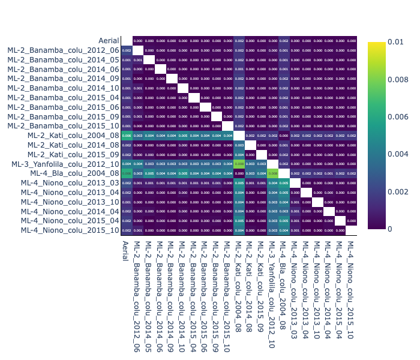
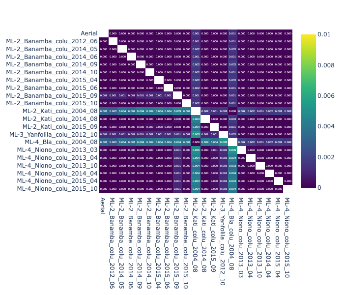
When using other chromosome arms, the most salient population is the one from Yanfolila in 2012, though the Fst values are even smaller for chromosome arm 3L and 3R. 
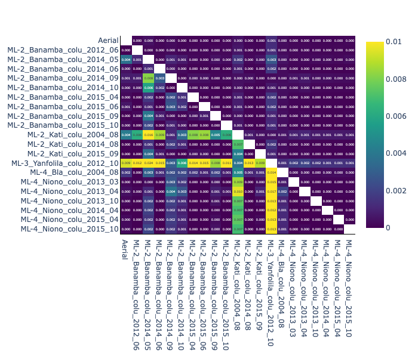
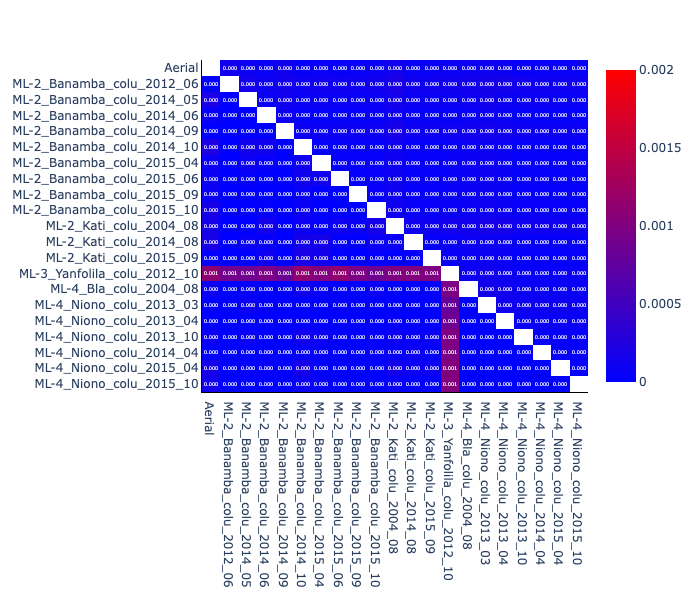
Looking in more details on where the Fst comes from using a windowed approach, we observe that most of the Fst comes from a region around 18~35 Mbp, which covers the known inversion [cite inversion paper] 2Rb.
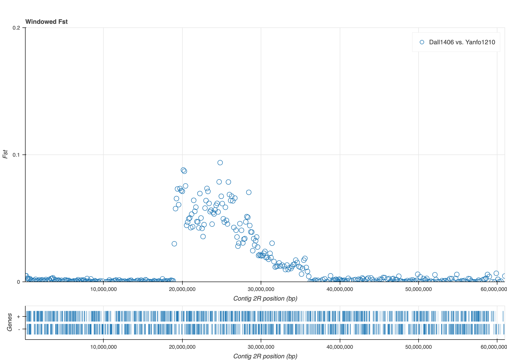
There might also be more localised regions of interest caused by different signals of selection that will be investigated more thoroughly with more adapted methods.
A quick comparison of the state of 2Rb, using the targets from [cite Love et al.], shows that the cohorts from Kati or Banamba tend to have more alternate alleles than reference while the opposite is true for Yanfolilla.

The aerial mosquitoes yield also higher Fsts when compared to other populations when Fst is computed using only the X chromosome but not as much when using other chromosome arms instead. 
If considering only the cohorts that are more recent (not from 2004) and not as geographically distant (excluding the cohort from Yanfolila), time and distance seem to have little effect on Fst. 

The situation is somewhat similar for _An. gambiae_. 
When looking at the X chromosome, two cohorts yield significantly higher Fst results when compared to any other cohort and they are the cohort from Kati 2004 and the only cohort from Yanfolila. 
Looking at the chromosome arm 2R, these two cohorts plus the other cohort from 2004 (Bla) yield much higher Fsts. 
When looking at the 3 other chromosome arms, the temporal effects seems to be much less pronounced and the cohort from Yanfolila is the only one yielding higher Fst results.

As expected, when all taxa are compared, the Fst values separate cohorts depending on their taxon. The Fst yielded by pairs containing arabiensis are also much higher which is consistent with _An. arabiensis_ being more diverged from the _An. gambiae_ / _An. coluzzii_ group than _An. coluzzii_ is diverged from _An. gambiae_. 

When the analysis is extended to cohorts coming from different countries, some geographical structure seems to appear. 
Among _An. coluzzii_, the samples from Guinea yield significantly higher values when compared to other cohorts. 
The samples from coastal regions in Benin, Côte d'Ivoire and Ghana seem to form a distinct group.

When all taxa are considered, Fst separates the taxa in the expected fashion: _An. melas_ cohorts yield high Fst compared with any non-melas cohort, _An. arabiensis_ does as well but to a lesser extent. 
_gcx4_ yields similar values as _An. arabiensis_ but has a high Fst when compared to _An. arabiensis_ cohorts. 
Finally, _gcx1_ and _gcx2_ yield results similar to _An. gambiae_ and _An. coluzzii_ though _gcx1_ seems to yield values in the same range compared to _An. gambiae_ and _An. coluzzii_ whereas _gcx2_ yields lower values when compared to _An. coluzzii_.

These observations are generalized across all chromosome arms but X tends to show sharper differences between taxa.

We also looked at some cohorts that yielded low Fst and observed that the values are slightly lower between the cohorts in Mali than they are when comparing with ones in Burkina Faso. 
When assigning samples from these cohorts randomly, the Fst values are even lower showing that there might be some population structure between the populations in Mali but it is very weak. 

## SNPs

- IR profiles are very similar for every population of the same taxon and some are different between taxa?
- Some temporal trends observed elsewhere (para) present here as well but somewhat muddled in some locations
- We have not found any location specific SNP

## CNVs

- I am still unclear on the final result of that analysis

## Haplotypes

- IR haplotypes are highly shared between locations and sometimes taxa?

## Locator

- Pretty good at high level (including on new data)
- Does not work at the required definition

## Doubleton-sharing

- Didn't find a geographical or temporal correlation ?

## IBD

- Still to be seen

